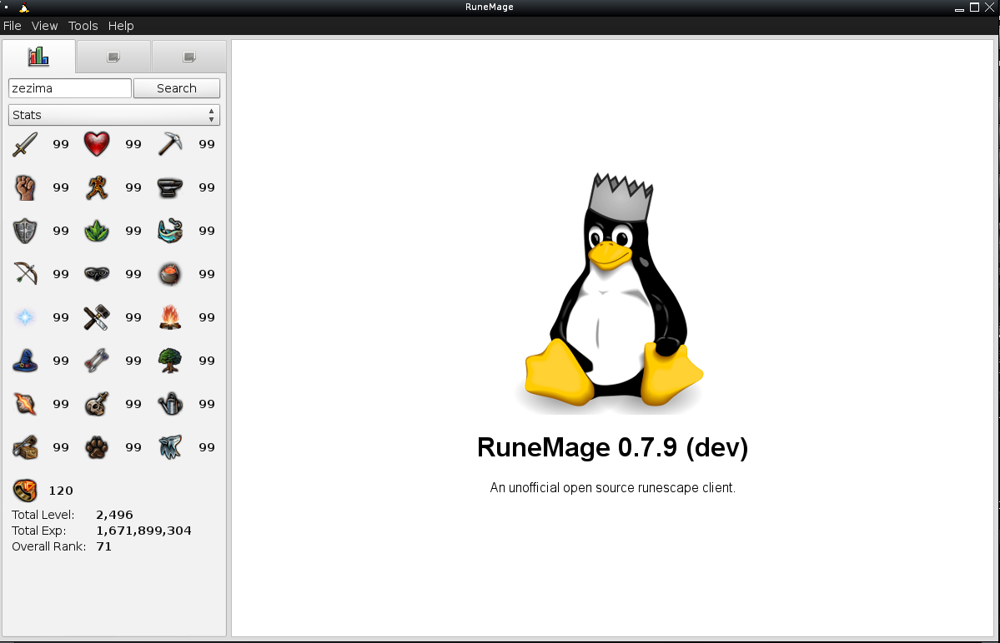
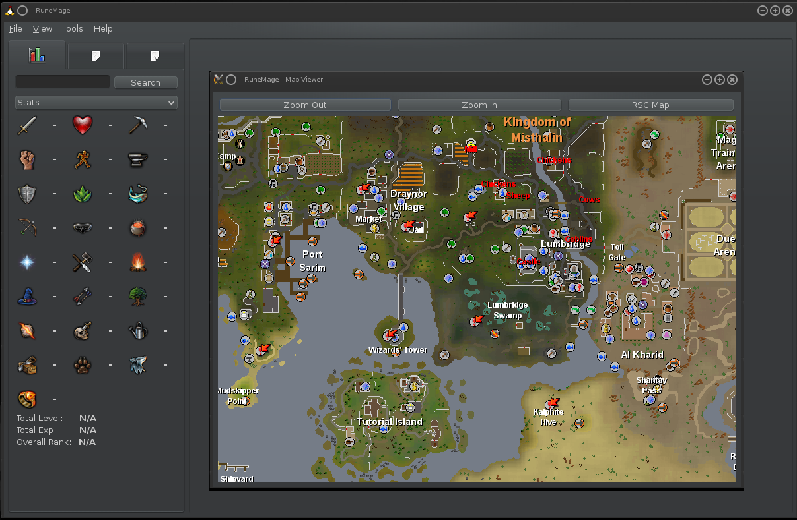

# RuneMage
A perl-gtk2 frontend for runescape on *nix platforms.

PLEASE NOTE.
Discontinued indefinetely, since mozembed was dropped by XUL developers several years back. 
There was an initial port to perl-webkit, however it refuses to build on my end. Some of the program is still 
functional, and needs alot of updating however. The grand exchange code also broke alot time ago, due to site changes and parsing problems.






## To run the client;

```$ ./runemage.pl```

## Features:
	Hiscore Lookup
		Skills (exp, lvls, ranks)
		Minigames (ranks)
		
	Grand Exchange price checking !! removed (incompatible since ~2011-2012) !!
		Compare prices of items on the grand 
		exchange, and how much they have changed 
		over time.

	Compact / Lightweight browser alternative
		Less desktop clutter while playing
		
	Map Viewer
		Switch between rs2/classic maps
		Zoom / Pan
		
	Adventure Log access 
		View a players recent activitys		
		(only works for members accounts, and 
		needs to be public on their profile)

## Built in commands:

Display the version and exit
```--version```


